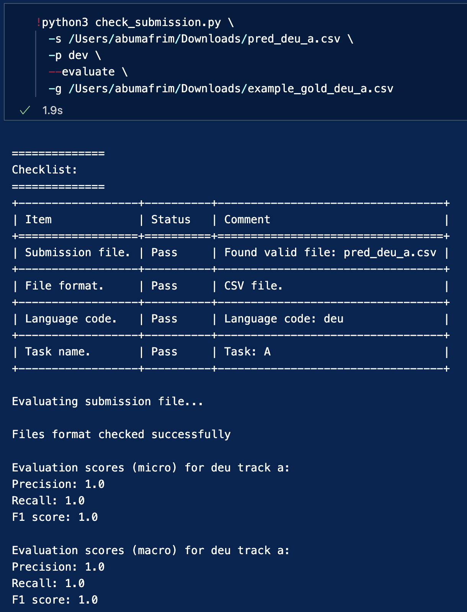

# SemEval2025-Task11:  Submission Formatting Check and Evaluation Instructions


This repository contains the necessary files and instructions for SemEval2025-Task11 participants to check the formatting of their submissions and evaluate them.


### 1. Set up the required environment

Install the required dependencies by running:

```bash
pip install -r requirements.txt

```

## 2. Prepare your submission file
Ensure that your submission file is properly structured and contains the required predictions using the language code as per the task. The languages are:

`afr, arq, amh, arb, ary, eng, esp, deu, hau, hin, ibo, ind, jav, kin, mar, orm, ptbr, ptm, pcm, ron, rus, som, sun, swa, swe, tat, tir, tsn, tso, ukr, xho, yor, zho, zul`

## 3. Verify the submission format

To ensure your submission is valid and meets the requirements, use the `check_submission.py` script. This will ensure that your file follows the task’s requirements. Check this guide for more information about [participation and submission](https://docs.google.com/document/d/1yETTEiD8JVL8oeXu8Dvwc7OgPIDp0ROxd9nXifsXYYE/edit). 

```bash
python check_submission.py -p dev --submission <path_to_your_submission_file>

```

This script checks whether:

- the structure and the formatting are correct,
- the necessary predictions (per language) are included,
- the files comply with the shared task’s requirements in general.

Make sure that this script runs without errors before proceeding with the evaluation.

**- Examples of properly formatted files**:  [Track A (English)](https://github.com/emotion-analysis-project/SemEval2025-Task11-Evaluation/blob/main/sample_submission_format/pred_eng_a%20copy.csv) and [Track B (German)](https://github.com/emotion-analysis-project/SemEval2025-Task11-Evaluation/blob/main/sample_submission_format/pred_eng_a%20copy.csv))


##  4. Run the evaluation

Once the submission passes the format validation, you can evaluate its performance by running the evaluation script provided in the Jupyter notebook `check_submission.ipynb`.


### Running the notebook

- Open the `check_submission.ipynb` file in a Jupyter environment.
- Make sure to set the correct file paths for your submission and test data.
- Run the cells to compute the evaluation metrics (e.g., accuracy, precision, recall, F1 scores).


Alternatively, if you're running it as a script, make sure thta you have the necessary parameters (e.g., the right paths to your files).

## 5. Review the evaluation results

After the evaluation, the script will output various metrics (see below, example for German), such as accuracy, precision, recall, and F1 scores for each language.



**Note** This is an example for Track A.

## 6. Zip the submission file

- If you want to automatically zip the file after validation and evaluation, add this flag (see below): ` --zip_for_submission \`


- The script zips the submission file automatically and your file will be ready to upload! The following message will confirm that your file is zipped:

`Zipped file: pred_<language_code>_<task>.zip is ready for upload in the Codalab submission page.`

## 7 Submit the zipped file

- Upload the zipped file to the Codabench as your final submission.


